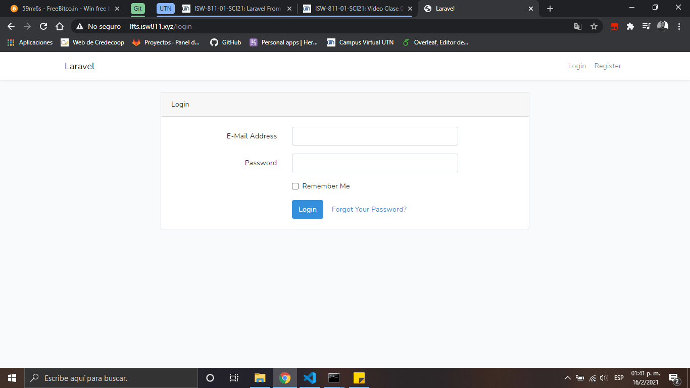

# Build a Registration System in Mere Minutes

1. Extraemos los componentes que nos brinda laravel

    ```bash
    composer require laravel/ui:1.3.0
    ```

2. Usaramos la vistas que proporciona vue js

    ```bash
    php artisan ui vue --auth
    ```

3. Generamos los componentes de authenticacion

    ```bash
    php artisan ui:auth
    ```

4. Extraemos los componentes que nos brinda laravel

    

5. Compilamos la paqueteria para que vue genere nuestra interfaz

    ```bash
    npm install && npm run dev
    ```

6. Compilamos las vistas y nos quedaria algo asi:

    

    Despúes probamos si funciona registrandonos y luego haciendo session.

[Regresar al menu Authentication](./menuAuth.md)
