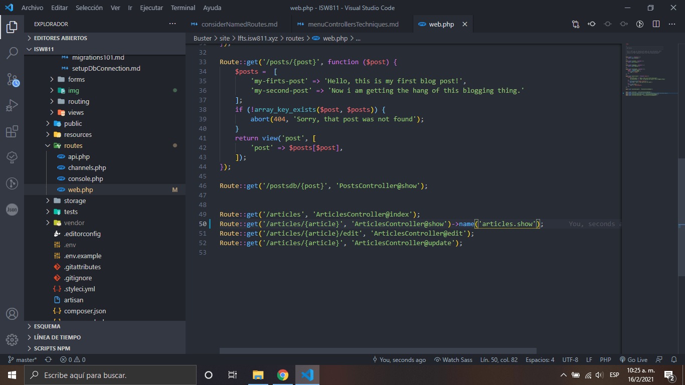
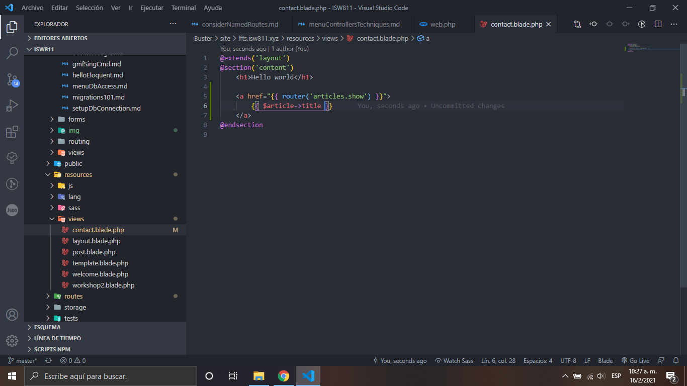

# Consider Named Routes

1.  Añadimos un nombre a nuestra ruta

    

2.  En el enlace de nuestra vista agregamos la ruta con el nombre asignado en el archivo de rutas web.php
    

3.  Añadimos el siguiente código al modelo

    

[Regresar al menu controllers techniques](./menuControllersTechniques.md)
