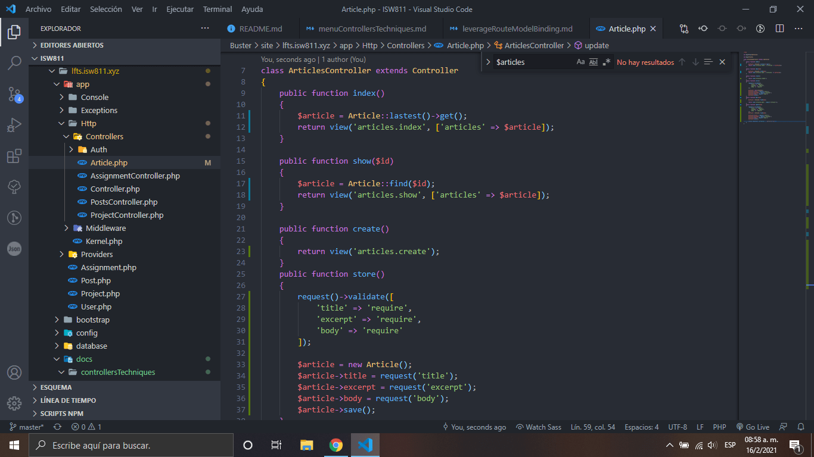

# Leverage Route Model Binding

1. Agregamos 6 metedos que nos ayudara a administrar nuestro datos, el primero es el index que nos ayudara obtener los ultimos agregados

2. Show nos permitira mostrar un articulo extrayendolo por ID

3. Create nos traera el formulario de para crear el articulo, store se encarga de validar y meter el nuevo articulo a la base de datos

4. Edit busca el articulo y lo retorna hacia el articulo hacia el formulario

5. update actualiza los campos.

    
    

[Regresar al menu controllers techniques](./menuControllersTechniques.md)
