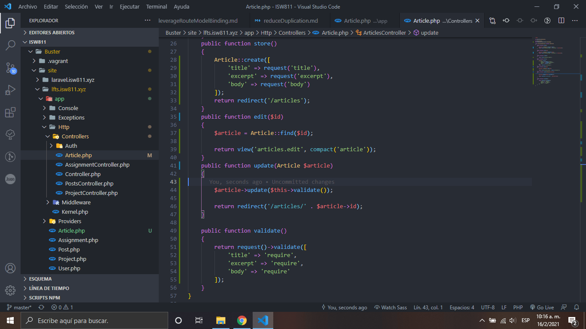

# Reduce Duplication

1. Cambiamos lo anterior del metodo store e insertamos un nuevo articulo

    

2. Creamos el modelo de articles

    

3. Quitamos los datos redundantes del controlador

    

[Regresar al menu controllers techniques](./menuControllersTechniques.md)
