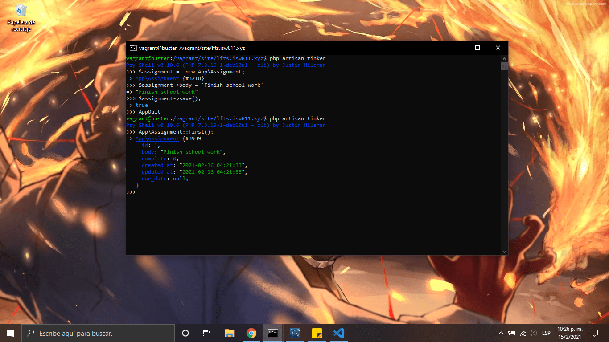
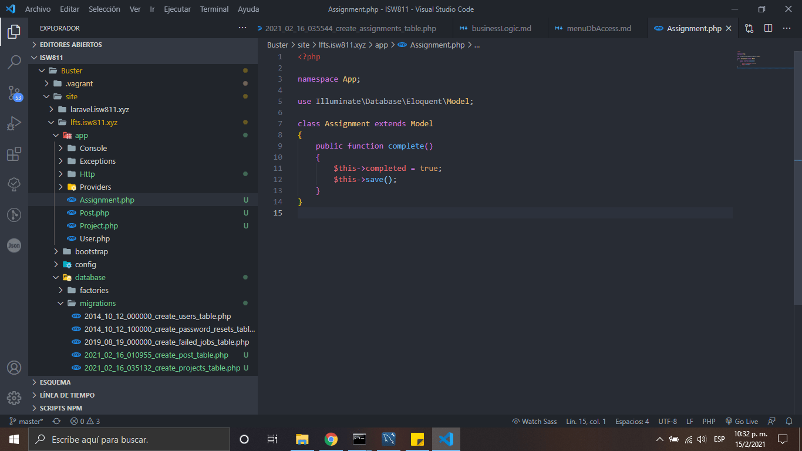

# Business Logic

1.  Para generar multiples archivos con un comando ejecutaremos el sigiente comando, este nos genera la migracion, model y controller.

    ```bash
    php artisan make:model Assigments -mc
    ```

2.  Generamos los siguientes campos en la migración de assigments, despúes ejecutamos el comando:

    

    ```bash
    php artisan migrate
    ```

3.  Insertamos un nuevo valor a la tabla desde cmd, ingresamos los siguientes comandos

    ```bash
    php artisan tinker
    $assignment->body = 'Finish school work'+
    $assignment->save();
    App\Assignment::first();
    ```

    

    

4.  Al modelo le agregamos una funcion

    

    ```bash
    php artisan tinker
    App\Assignment::first();
    $assignment->complete();
    ```

[Regresar al menu data base access](./menuDbAccess.md)
