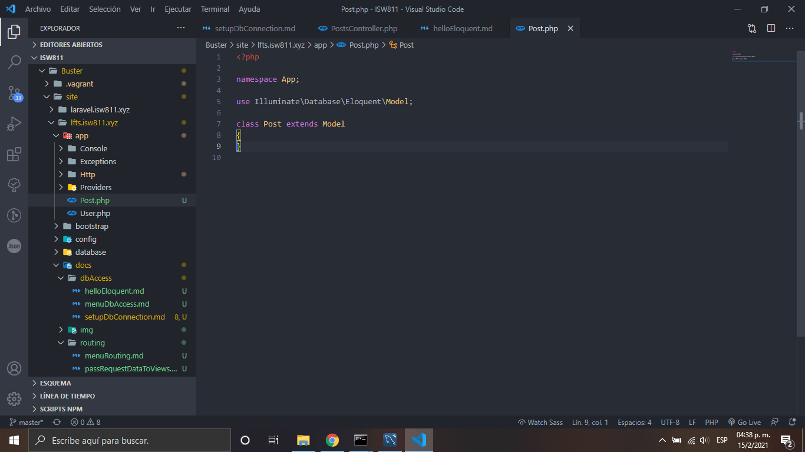
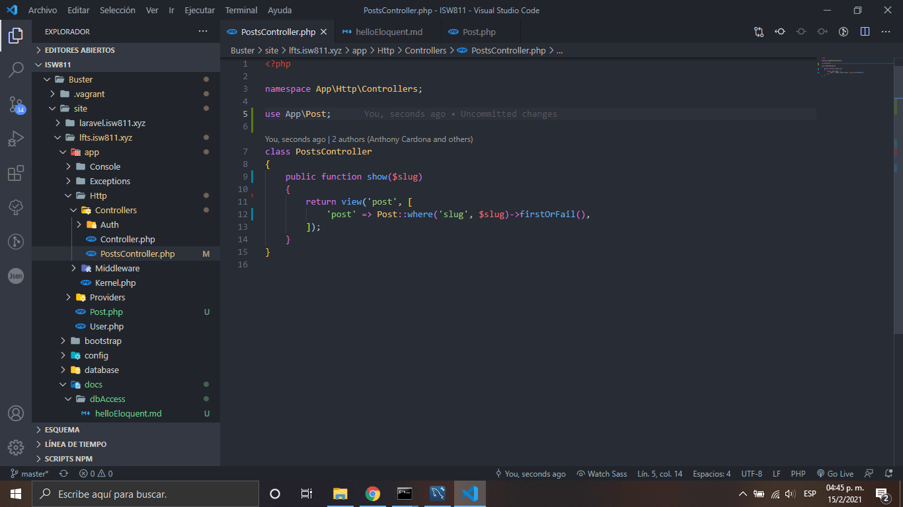

# Hello Eloquent

1. Agregamos un use DB, para llamar al metodo DB que se encuentra dentro del metodo de show, además agregamos una validacion por si el datos que le estamos pasando por el request no existiera.

    

2. Creamos nuestro model para el maquetado de datos, con su respectiva estructura inicial

    

3. En nuestro PostController cambiamos el anterior codigo y lo remplazamos por uno mas simplificado

    

    [Regresar al menu data base access](./menuDbAccess.md)
