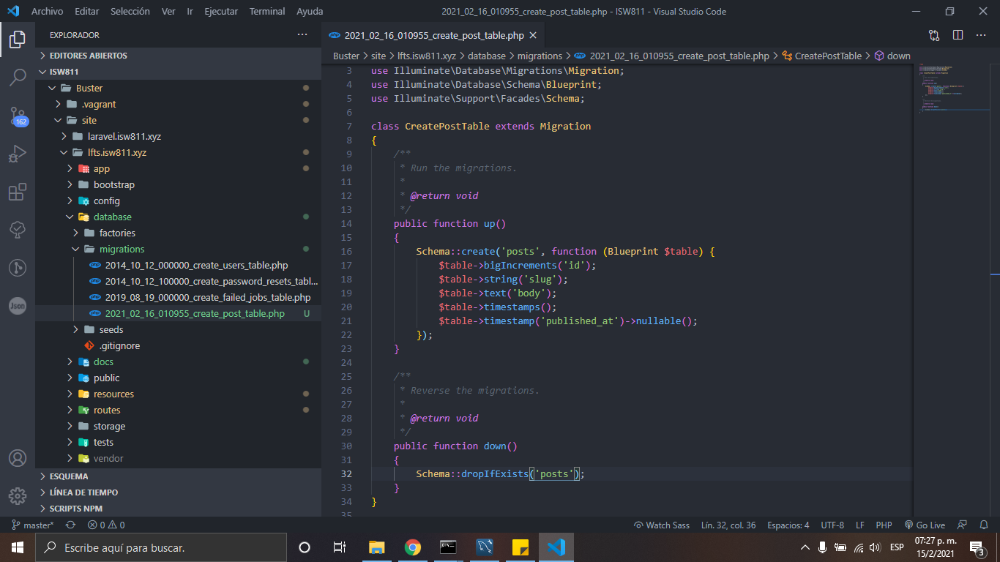
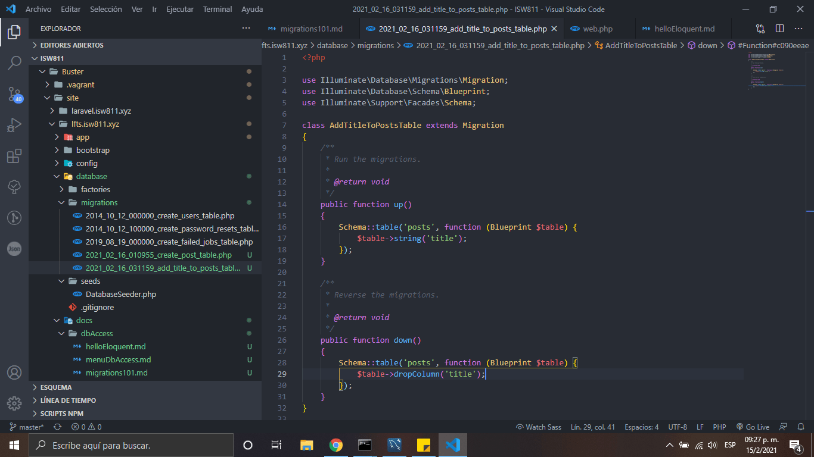

# Migrations

1. Creamos nuestra migracion con el siguiente comando

    ```bash
    php artisan make:migration create_posts_table
    ```

2. Despúes de crear nuestro archivo de migración crear nuestra tabla desde laravel
   

3. Corremos el siguente comando para generar nuestra tabla de posts en la base de datos anteriormente creada

    ```bash
    php artisan migrate
    ```

4. Generamos una migracion con el comando

    ```bash
    php artisan make:migration add_title_to_posts_table
    ```

5. Ingresamos el siguente código dentro de la migracion

    

6. Ingresamos el siguente comando para generar la nueva migración

    ```bash
    php artisan migrate
    ```

7. Eliminamos la ultima migración add title to posts table y ingresamos la nueva columna llamada title a la migración post table, despúes corremos los siguientes comandos:

    ```bash
    php artisan migrate:rollback
    php artisan migrate:fresh
    ```

[Regresar al menu data base access](./menuDbAccess.md)
