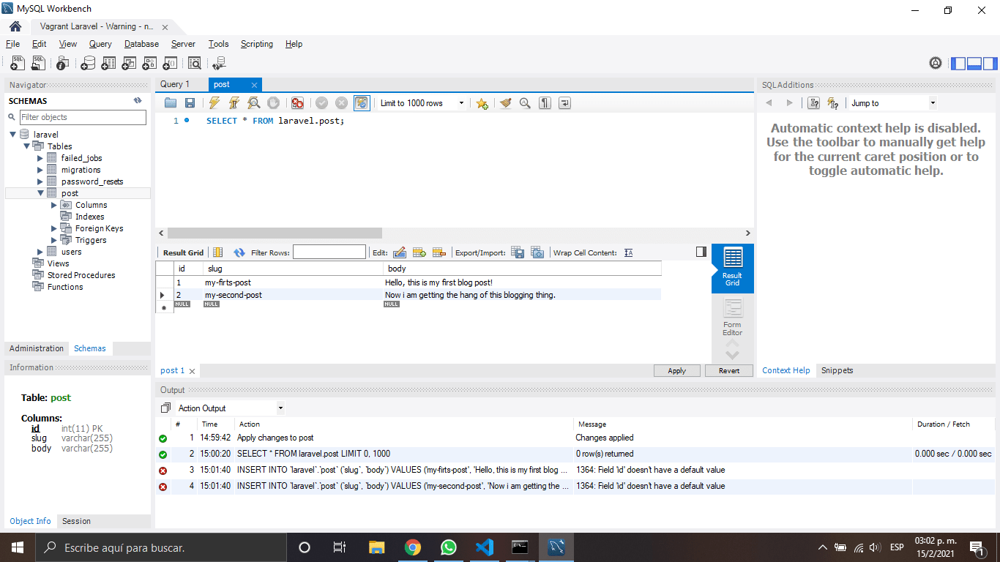
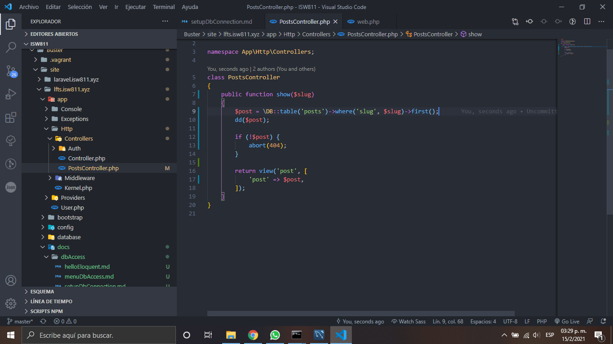

# Setup a Database Connection

1.  Debemos agragar nuestra configuración de nuestra base de datos en el archivo .env

    ```bash
        DB_CONNECTION=mysql
        DB_HOST=127.0.0.1
        DB_PORT=3306
        DB_DATABASE=laravel
        DB_USERNAME=laravel
        DB_PASSWORD=laravel
    ```

    

2.  Los datos que teniamos en las ruta web.php los pasamos a la base de datos
    

3.  Agregamos una nueva ruta esta se encargara de enlazar con el controlador para mostrar los datos

    

4.  Dentro del PostController creamos una funcion show en cual será la encargada de traerme los datos de la base datos

    ```php
     $post = \DB::table('post')->where('slug', $slug)->first();
    ```

    

5.  Creamos nuestra vista post.blade.php

    

6.  Verificamos que los datos se hayan extraido exitosamente

    

    #### Nota: Debemos quitar la linea dd($post) para que nos muestre el contenido de nuestro archivo post.blade.php

    

[Regresar al menu data base access](./menuDbAccess.md)
