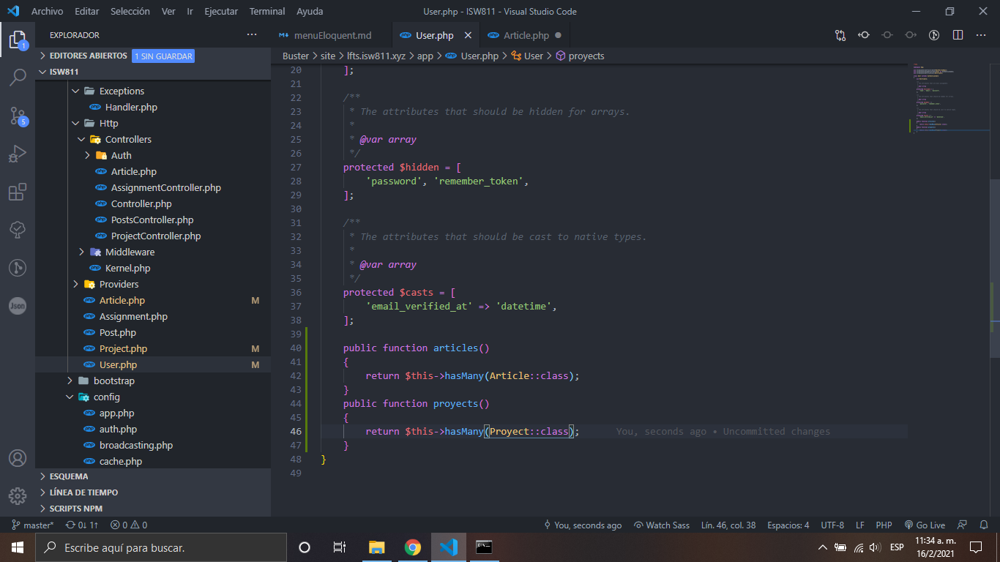
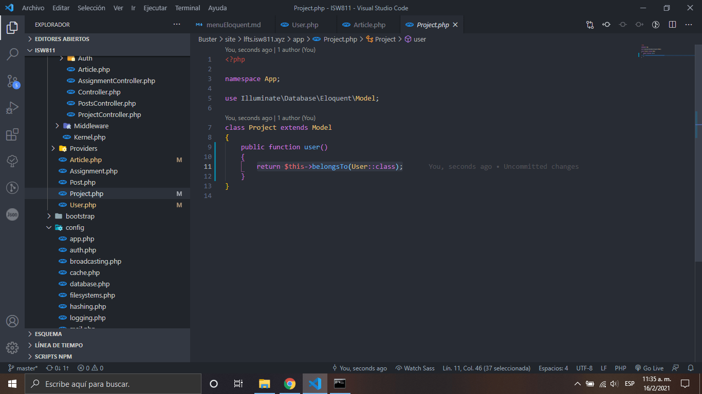

# Basic Eloquent Relationships

1. Añadimos el modelo de usuario las relaciones que este caso seria a articulos y proyectos

    

2. Añadimos la relación de articulo al modelo usuario

    

3. Añadimos la relacion de usuario a proyecto

    

[Regresar al menu Eloquent](./menuEloquent.md)
