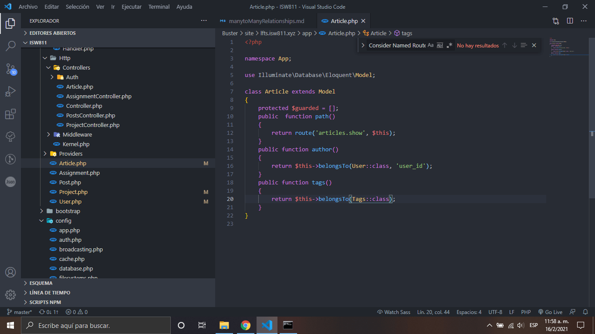

# Many to Many Relationships With Linking Tables

1. Añadimos el modelo con sus respectivas llaves foraneas y campos

    

2. Añadimos la relación de articulo al modelo usuario

    

3. Despues de haber realizado lo anterior corremos el siguente comando

    ```bash
    php artisan migrate
    ```

[Regresar al menu Eloquent](./menuEloquent.md)
