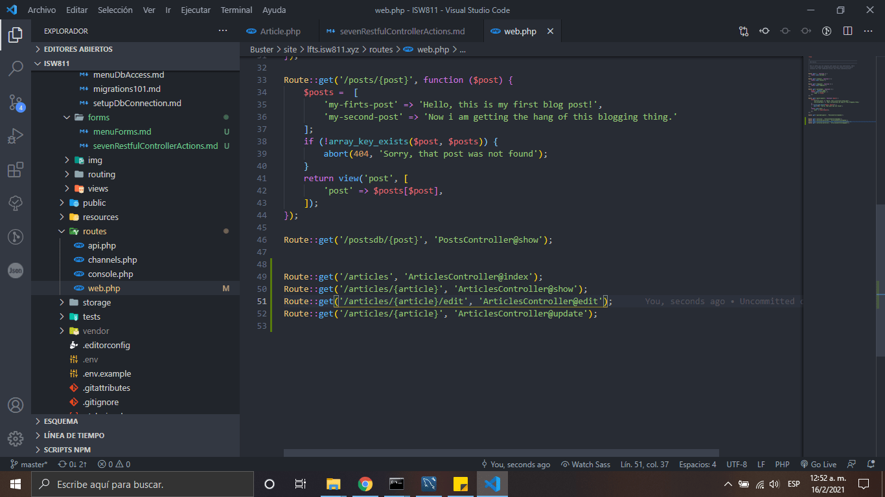

# The Seven Restful Controller Actions

1. Creamos nuestro controller encargado de enviar los datos a la base de datos

2. Ingresamos los siguientes comandos:

    ```bash
    php artisan make:controller ProjectController -r
    php artisan make:controller ProjectController -r -m Project
    ```

3. Agregamos las siguientes rutas
   

[Regresar al menu de Forms](./menuForms.md)
