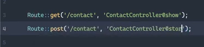
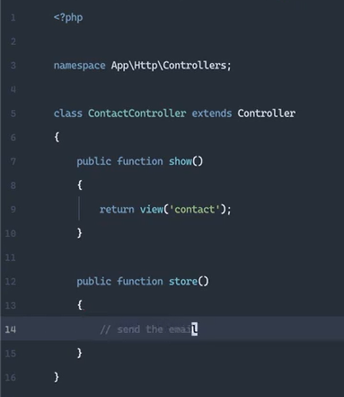
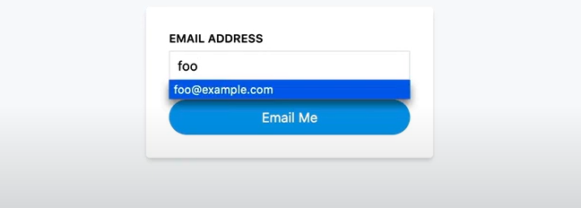
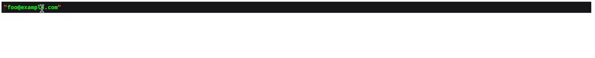
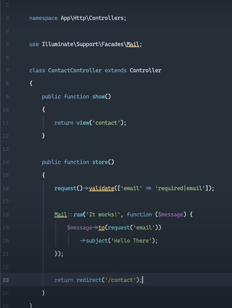

# Send Raw Mail

1. Primero creamos las rutas

2. Creamos el controlador que tendran nuestros metodos

3. Creamos el creamos la vistas donde se metera nuestro correo electronico

4. Verificamos que funcione

4. Agregamos el siguiente codigo para envie correos electronicos

