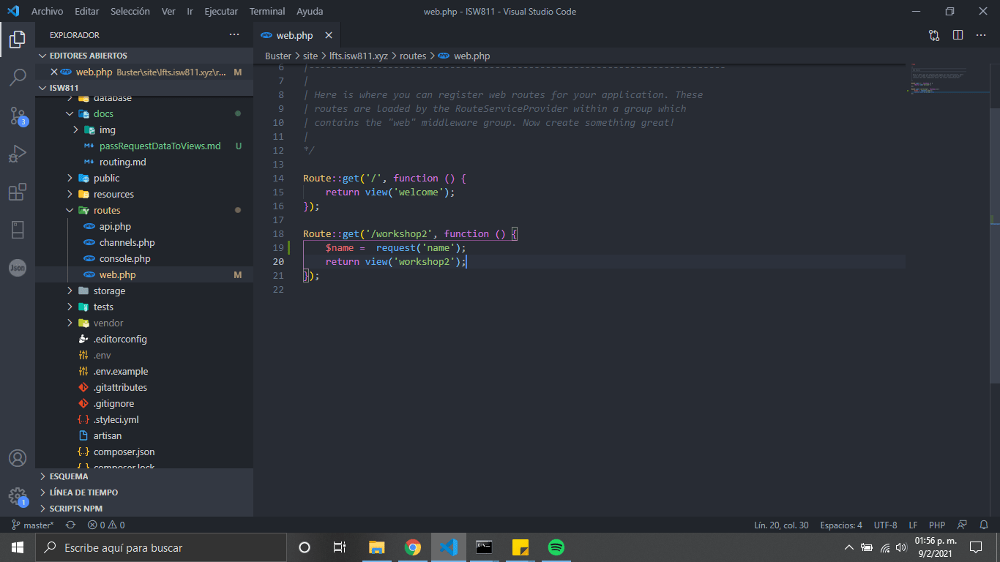
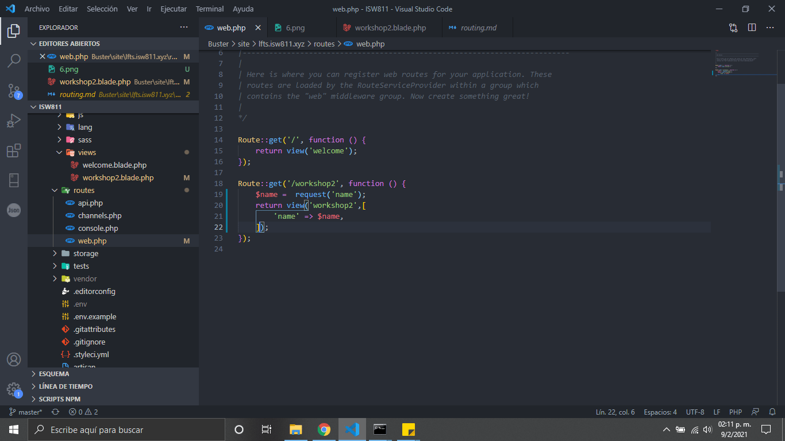
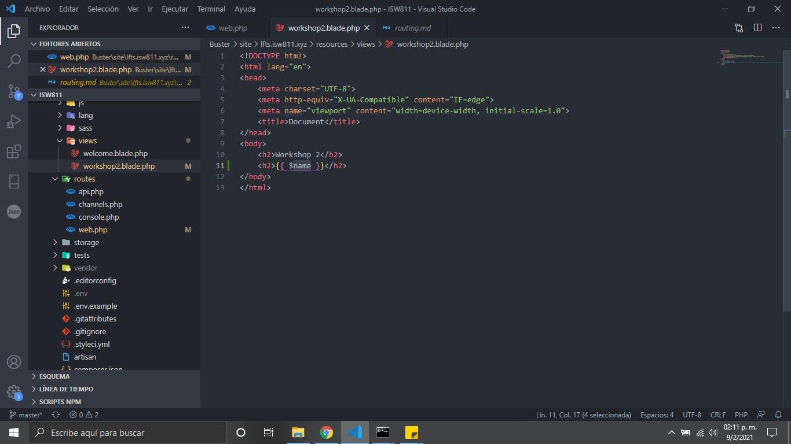
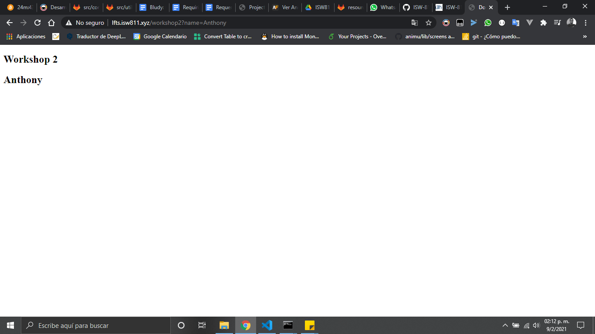

# Pass resquest data to views

1. Para pasar datos por los medio del request debemos configurar el web.php.
   

2. En la vista workshop 2 agregamos la variable a mostrar los datos

    

3. Agregamos la variable expuesta en el url

    

4. El resultado final seria

    
