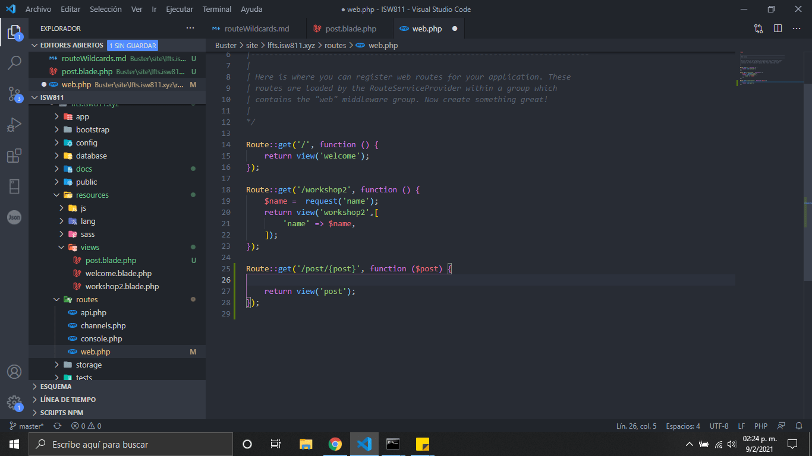
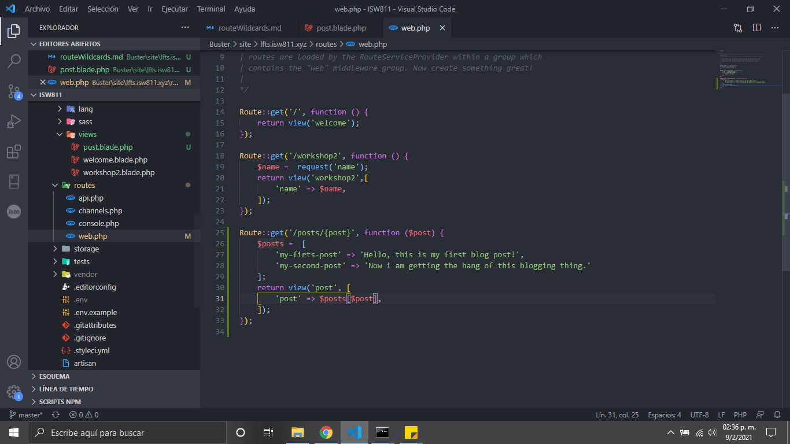

# Route Wildcards

1. Primero creamos una vista llamada post
2. En la ruta agregamos el siguente codigo. Esto nos permitira enviar parametros por la url
   
3. Creamos la vista del post y añadimos la variable que le vamos a enviar por parametro
   
4. Hacemos un array donde mostraremos diferentes mensajes, cuando mandamos diferentes datos por parametro en la ruta
   
5. agregamos una configuracion para la validacion de las diferentes rutas el post
   
6. Asi quedaria el resultado
   
