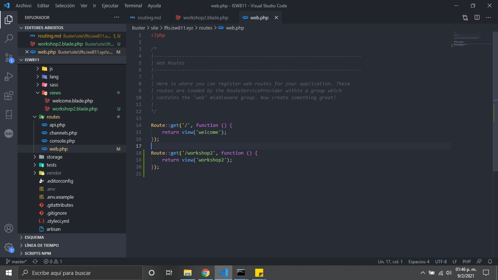

# Routing

1. Primero creamos una vista donde apuntara nuestra ruta, creamos la siguente vista dentro de resources/views llamada workshop2.blade.php.

2. Llamamos la vista que creamos dentro del archivo de routes/web.php

3. Esta seria la vista que tendriamos desde el navegador

