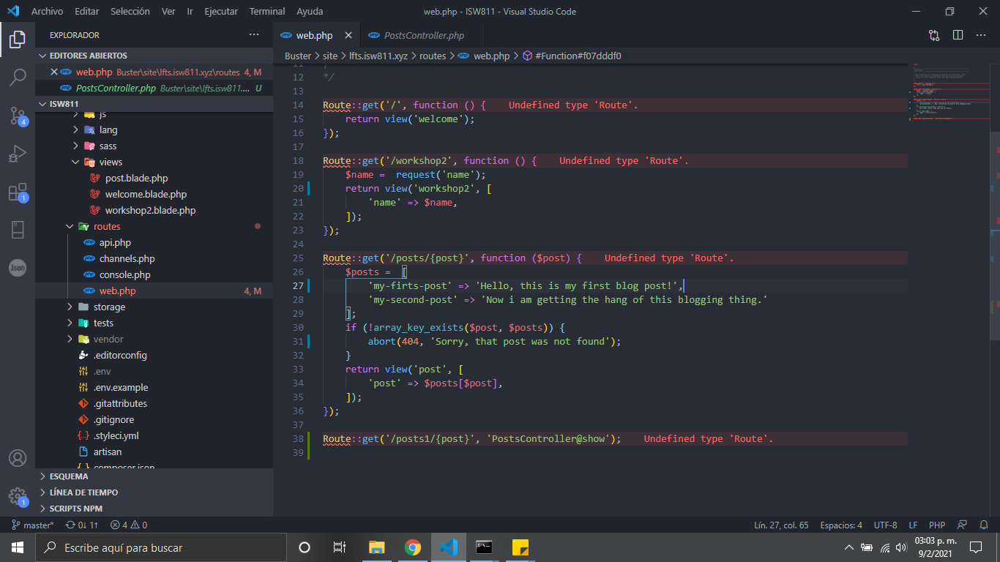
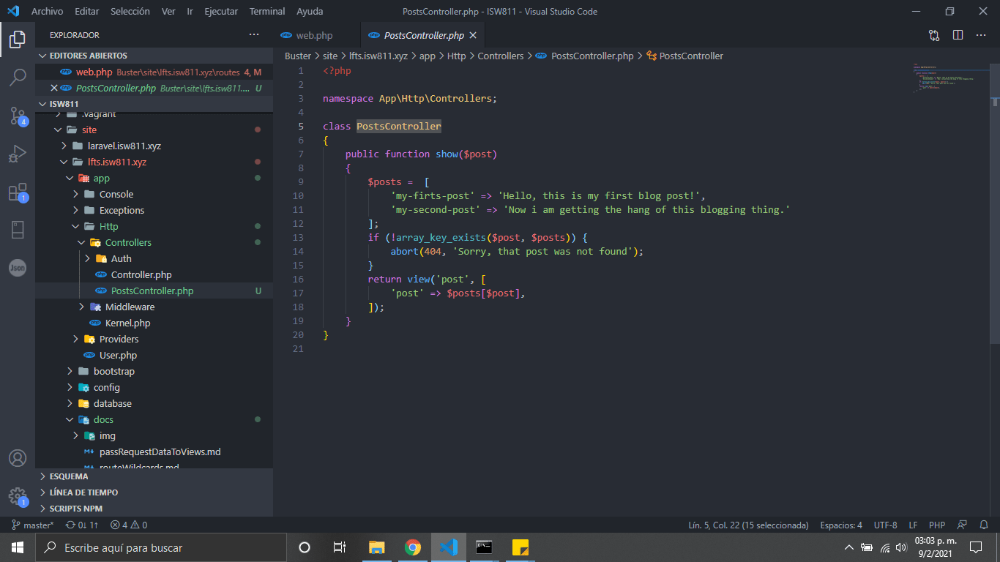
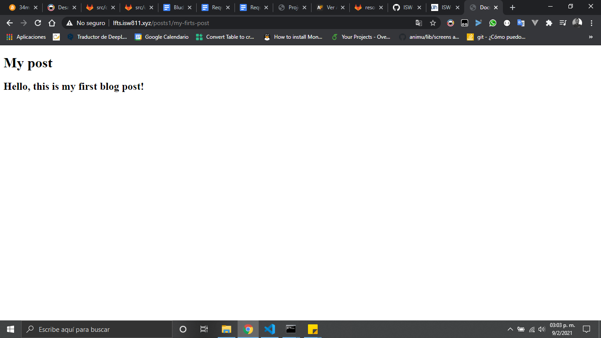

# Routing to Controllers

1. Creamos la ruta donde estara apuntando la vista hacia nuestro controlador
   
1. Creamos nuestro controlador con el siguente código

```bash
    class PostsController
    {
        public function show($post)
        {
            $posts =  [
                'my-firts-post' => 'Hello, this is my first blog post!',
                'my-second-post' => 'Now i am getting the hang of this blogging thing.'
            ];
            if (!array_key_exists($post, $posts)) {
                abort(404, 'Sorry, that post was not found');
            }
            return view('post', [
                'post' => $posts[$post],
            ]);
        }
    }

```



5.Este seria el resultado

