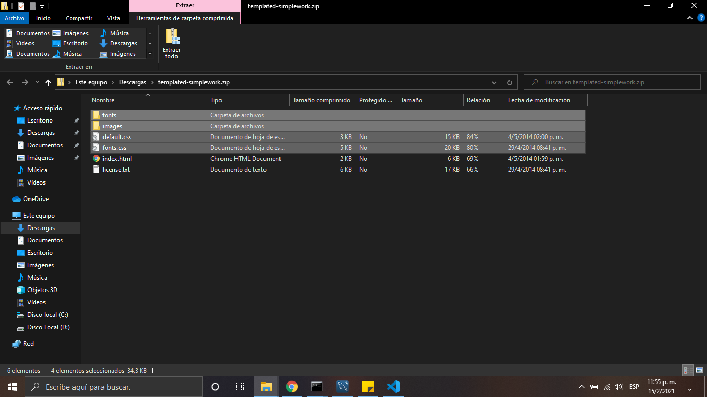
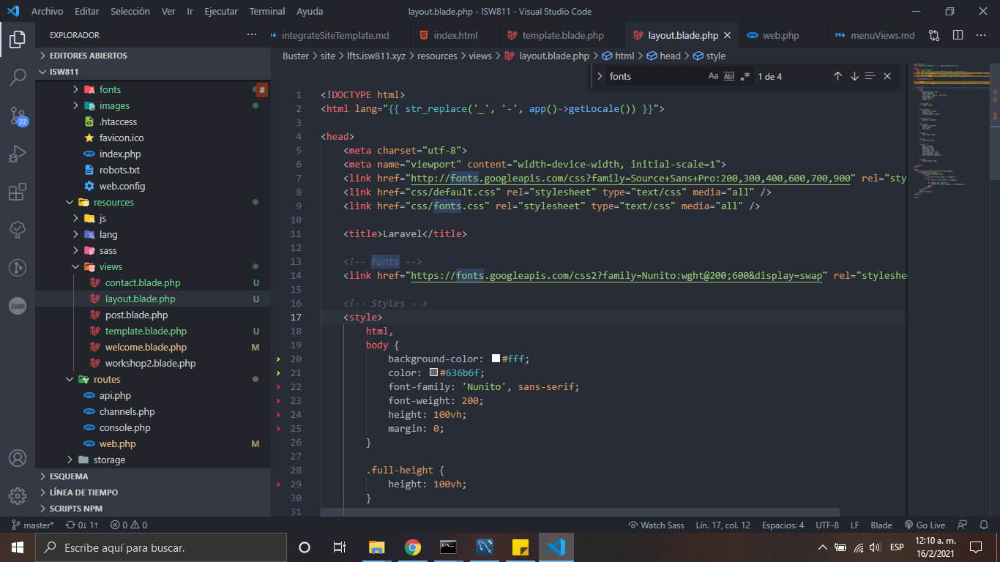
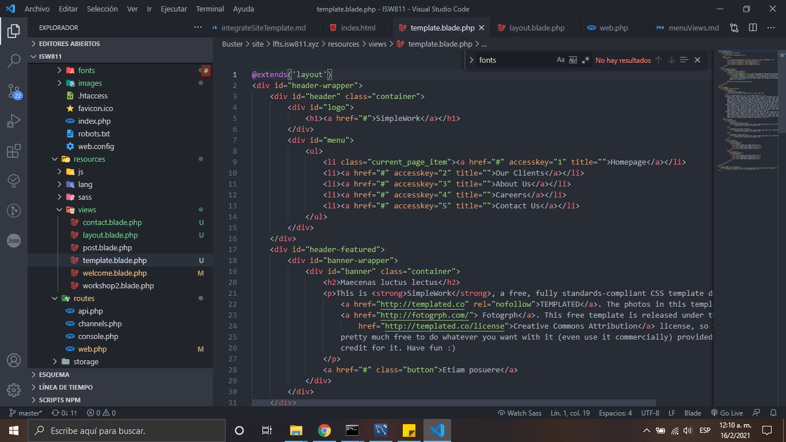

# Integrate site template

1. Descargamos el templated [Simple work](https://templated.co/simplework)

2. De la carpeta comprimida pasamos los siguientes archivos hacia nuestra carpeta public.

    

3. Modificamos el nuevo archivo de templade.blade.php

    

4. Asi quedaria nuestro templade.

    
