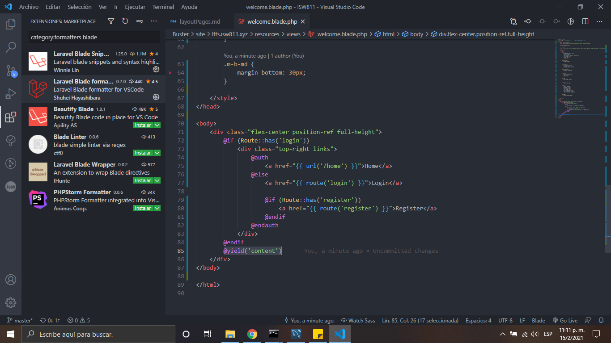
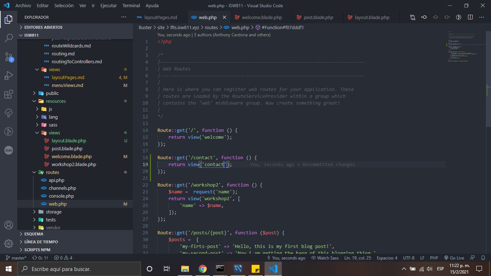
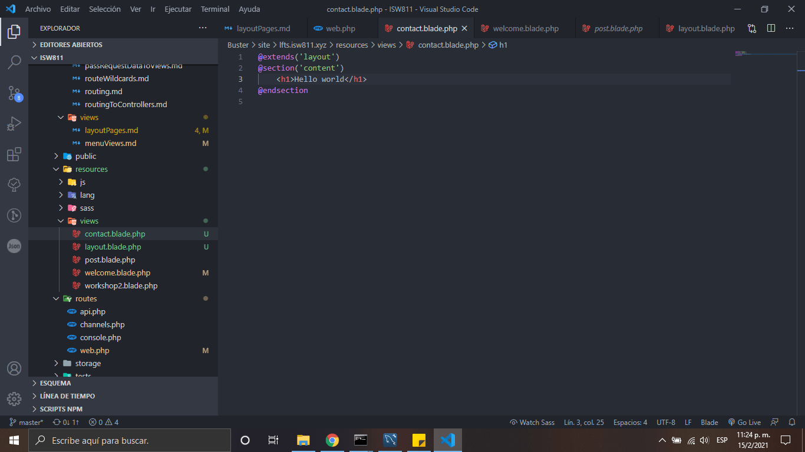
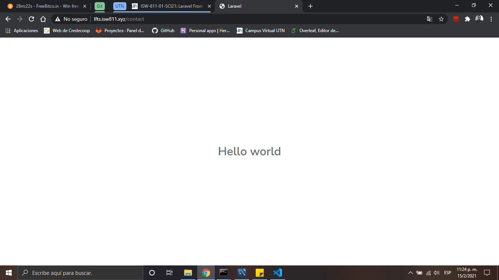

# Layout Pages

1.  Creamos un welcome.blade.php en el metemos lo siguiente:

    ```
    @extends('layout')
    @section('content')
        <div class="content">
            <div class="title m-b-md">
            Laravel
            </div>
                <div class="links">
                    <a href="https://laravel.com/docs">Docs</a>
                    <a href="https://laracasts.com">Laracasts</a>
                    <a href="https://laravel-news.com">News</a>
                    <a href="https://blog.laravel.com">Blog</a>
                    <a href="https://nova.laravel.com">Nova</a>
                    <a href="https://forge.laravel.com">Forge</a>
                    <a href="https://vapor.laravel.com">Vapor</a>
                    <a href="https://github.com/laravel/laravel">GitHub</a>
                </div>
            </div>

    @endsection
    ```

2.  Despúes agregamos en la parte superior del layout lo siguiente:

    ```php
    @extends('layout')
    ```

3.  Despúes agregamos en la parte superior del welcome lo siguiente:

    ```php
    @yield('content')
    ```

    

4.  Agregamos a web.php la ruta de contact

    

5.  Creamos nuestra vista contact.blade.php y le agregamos de donde se extiende la vista

    

6.  Asi quedaria la vista final

    

[Regresar al menu de views](./menuViews.md)
