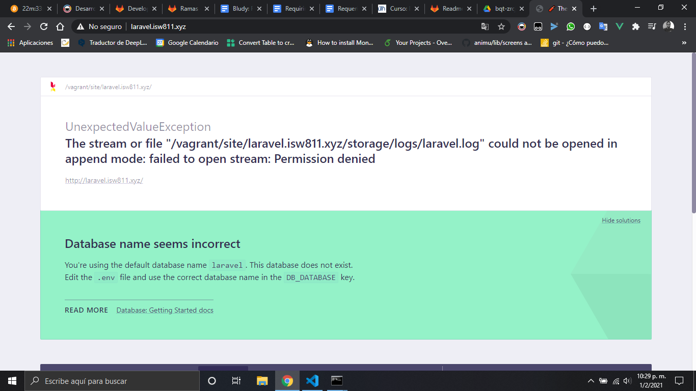

### GNU/Linux Debian Buster con Vagrant

#### Pasos de instalación:

1.  Inicialment se descarga [Virtualbox](https://www.virtualbox.org/), luego de haber terminado la descarga se procede a la instalación.

    

2.  Procedemos a descargar [Vagrant](https://www.vagrantup.com/) y despues de haber terminado la descarga procedemos con las instalación, como bien se sabe en windows solo requerimos dar siguente y siguente.

    

    

3.  Despues haber terminado la instalación nos pedira reiniciar la computadora.

    

4.  Cuando hemos terminado de reiniciar procederemos a ir [Vagrant Cloud](https://app.vagrantup.com/boxes/search?utf8=%E2%9C%93&sort=downloads&provider=&q=debian+buster), seleccionamos [debian/buster](https://app.vagrantup.com/debian/boxes/buster64)

    

5.  Ahora seleccionamos la pestaña new

    

6.  Prodecemos a abrir la consola de windows y digitamos los siguientes comandos:

    1. Creamos una carpeta donde ira nuestro Buster, en mi caso lo almacenare en mi segundo disco local D.

       ```bash
       D:\Documents\isw811> mkdir Buster
       ```

    2. Luego procedemos a instalar el debian buster:

       ```bash
       D:\Documents\isw811>vagrant init debian/buster64
       ```

    3. Abrimos visual studio code y descomentamos la linea 40, donde nos aparece:

       ```
       config.vm.network "public_network"
       ```

       

    4. Corremos el siguiente comando:

       ```bash
       D:\Documents\isw811>vagrant up
       ```

    5. Se iniciara la descagar de la iso de debian y a su ves se instalara la maquina virtual con sus configuraciones predeterminadas de vagrant.

       

7.  Verificamos si nuestra maquina virtual esta corriendo:

    

8.  Verificamos el estado de la maquina virtual con:

    ```bash
    D:\Documents\isw811\Buster>vagrant status
    ```

    

9.  Nos conectamos a vagrant con ssh

    ```bash
    D:\Documents\isw811\Buster>vagrant ssh
    ```

    

10. Actualizamos la paqueteria

    ```bash
    vagrant@buster:~$ sudo apt-get update
    ```

    

11. Instalamos los siguientes paquetes necesarios:

    ```bash
    sudo apt-get install php7.3 php7.3-curl php7.3-json php7.3-mysql php7.3-pgsql php7.3-xml php7.3-zip php7.3-mbstring git curl vim vim-nox mariadb-server mariadb-client apache2
    ```

12. Instalación de vim

    ```bash
    sudo apt-get install git curl vim vim-nox
    ```

13. Clonamos el repositorio

    ```bash
    git clone https://github.com/mismatso/dotvim.git ~/.vim
    ```

14. Creamos link simbolico hacia el archivo de configuración de vim

    ```bash
    ln -s ~/.vim/.vimrc ~/.vimrc
    ```

15. Instalamos los plugins como submodulo de git

    ```bash
    cd ~/.vim
    git submodule init
    git submodule update
    ```

16. Instalamos el patogeno

    ```bash
    mkdir -p ~/.vim/autoload ~/.vim/bundle && \
    curl -LSso ~/.vim/autoload/pathogen.vim https://tpo.pe/pathogen.vim
    ```

17. Instalar las fuentes parcheadas para Vim-Airline

    ```bash
    ~/.vim/fonts/install.sh
    ```

    #### Nota: Si queremos que vim se vea igual a la hora de estar como super usuario debemos hacer los mismo pasos pero usuando este comando antes:

    ```bash
    sudo su
    cd
    pwd
    ```

18. Instalación de composer

    ```bash
    php -r "copy('https://getcomposer.org/installer', 'composer-setup.php');"

    php -r "if (hash_file('sha384', 'composer-setup.php') === '756890a4488ce9024fc62c56153228907f1545c228516cbf63f885e036d37e9a59d27d63f46af1d4d07ee0f76181c7d3') { echo 'Installer verified'; } else { echo 'Installer corrupt'; unlink('composer-setup.php'); } echo PHP_EOL;"

    php composer-setup.php

    php -r "unlink('composer-setup.php');"
    ```

19. Movemos composer para a la carpeta de instalaciones opcionales

    ```bash
    sudo mkdir -p /opt/composer
    sudo mv composer.phar /opt/composer/
    ls -la /opt/composer
    ```

20. Creamos link simbolico hacia el archivo composer

    ```bash
    sudo ln -s /opt/composer/composer.phar /usr/bin/composer
    ```

    

21. Instalamos laravel en la version 6.20

    ```bash
    composer create-project laravel/laravel:6.20
    ```

    

22. Generamos la key y verificamos

    ```bash
     php artisan key:generate
     cat .env
    ```

23. Comprimimos la carpeta del proyecto que hemos hecho con laravel.

    ```bash
     zip -r laravel.zip  laravel
    ```

24. Agregamos una nueva identidad con ssh desde nuestra maquina local

    ```bash
    D:\Documents\isw811\Buster\.vagrant\machines\default\virtualbox>ssh-add private_key
    ```

    Nos reponderia: Identity added: private_key (private_key)

25. Antes de conectarnos para pasar el zip a la maquina local debemos cambiar una confirguracion dentro sshd_config

    ```bash
     eval $(ssh-agent)
     sudo nano /etc/ssh/sshd_config
     sudo service ssh restart
    ```

    

    Cambiamos en la linea passworAuthentication de no a yes y guardamos cambios.

26. Conectamos desde nuestra maquina local hacia nuestra maquina virtual con ssh y aceptamos la huella.

    ```bash
     D:\Documents\isw811\Buster>ssh vagrant@192.168.1.163
    ```

    

27. Despues haber comprobar que logramos ingresar, no salimos e insertamos el siguente comando para exportar los archivo zip del vagrant.

    ```bash
    scp vagrant@192.168.1.163:~/laravel.zip .
    rm -r laravel laravel.zip
    ```

    

28. Sicronizamos los cambios de maquina local a la virtual

    ```bash
    vagrant rsync
    ```

29. Verificamos que la sincronización se allá realizado correctamente

    

30. Cargamos el template del host cambiamos el nombre host y ordenamos de las carpetas donde ira la página web site/laravel.isw811.xyz. Sincronizamos cambios con el comando:

    

    ```bash
    vagrant rsync-auto
    ```

31. Habilitamos las caracteristicas del servidor y movemos el archivo de configuración y verificamos

    ```bash
    sudo a2enmod vhost_alias rewrite

    sudo cp laravel.isw811.xyz.conf /etc/apache2/sites-available/

    sudo a2ensite laravel.isw811.xyz.conf

    sudo apache2ctl -t

    sudo systemctl reload apache2
    ```

    

32. Configuramos el archivo host de windows y despues compro vamos si la conexion de hacia el dominio funciona.

    ```bash
    C:\Windows\System32\drivers\etc\hosts
    ping laravel.isw811.xyz
    ```

    

    

33. Listo desplegamos la aplicacion con el dominio laravel.isw811.xyz

    ```bash
    http://laravel.isw811.xyz
    ```

    

34. Para quitar este error, será necesario cambiar los permisos del sitio para ello creamos el siguente archivo dentro la carpeta Buster.

        #!/bin/bash
        while :
        do
        sleep 1
        chown www-data:www-data /vagrant/site/ -R
        done

    

35. Creamos una carpeta de scripts dentro opt, luego chown-sites.sh cambian los permisos y lo convertimos en un ejecutable, movemos el ejecutable hacia el directoria scripts y por ultimo le damos permisos de super usuario.

    ```bash
    sudo mkdir -p /opt/scripts
    chmod +x chown-sites.sh
    sudo mv chown-sites.sh /opt/scripts/
    sudo chown root:root /opt/scripts/chown-sites.sh
    ```

    

36. Creamos el archivo chown-sites.service, para levantar el script

    ```bash
    [Service]
    Type=simple
    ExecStart=/opt/scripts/chown-sites.sh

    [Install]
    WantedBy=multi-user.target
    ```

    

37. Movemos el archivo chown-sites.service a system, lo habilitamos y reiniciamos la maquina virtual

    ```bash
    sudo mv chown-sites.service /etc/systemd/system
    sudo systemctl enable chown-sites.service
    sudo reboot
    sudo systemctl status chown-sites.service
    ```

    
