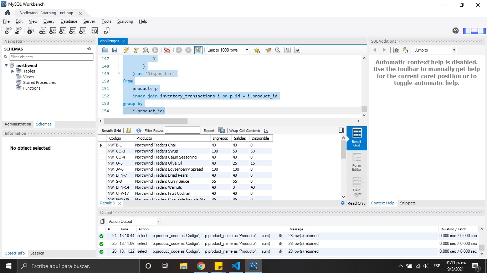

# Ejercicios Northwind Database

- Crear la base de datos Northwind, usuario y privilegios de usuario

```bash
CREATE DATABASE northwind;
create user laravel@'%' identified by 'laravel';
GRANT ALL PRIVILEGES ON northwind.* TO laravel;
FLUSH PRIVILEGES;
```

- Restaurar base de datos Northwind

```bash
sudo mysql northwind < northwind.sql -u root -p
sudo mysql northwind < northwind-data.sql -u root -p
```

## Challenge #1

- Recupere el código (id) y la descripción (type_name) de los tipos de
  movimiento de inventario (inventory_transaction_types).


```bash
desc inventory_transaction_types;

SELECT id as 'Codigo',
type_name as 'Descripción'
From inventory_transaction_types;
```

## Challenge #2

- Recupere la cantidad de ordenes (orders)
  registradas por cada vendedor (employees).


```bash
DESC orders;
DESC employees;

SELECT concat(e.first_name, ' ', e.last_name) as 'Vendedor',
count(1) as 'Cantidad' FROM orders o JOIN employees e ON e.id = o.employee_id
GROUP BY o.employee_id;
```

## Challenge #3

- Recupere la lista de los 10 productos más ordenados (order_details),
  y la cantidad total de unidades ordenadas para cada uno de los
  productos. Deberá incluir como mínimo los campos de código (product_code),
  nombre del producto (product_name) y la cantidad de unidades.


```bash
DESC order_details;
DESC products;

SELECT p.product_name, sum(od.quantity) as 'Cantidad'
FROM order_details od
JOIN products p
ON p.id = od.product_id
GROUP BY od.product_id
ORDER BY sum(od.quantity) DESC
LIMIT 10;
```

## Challenge #4

- Recupere el monto total (invoices, orders, order_details, products) y la
  cantidad de facturas (invoices) por vendedor (employee). Debe
  considerar solamente las ordenes con estado diferente de 0 y
  solamente los detalles en estado 2 y 3, debe utilizar el precio
  unitario de las lineas de detalle de orden, no considere el descuento,
  no considere los impuestos, porque la comisión a los vendedores se
  paga sobre el precio base.


```bash
DESC invoices;
DESC orders;
DESC order_details;
DESC products;
DESC  employees;

SELECT count(1) as `Cantidad` ,
concat(e.first_name, ' ' , e.last_name) as `Vendedor`,
round(sum(od.unit_price * od.quantity),2) as `Monto_factura`
FROM invoices i
JOIN orders o
ON o.id = order_id
JOIN order_details od
ON od.order_id = o.id
JOIN employees e
ON e.id = o.employee_id
WHERE o.status_id <> 0
AND od.status_id in (2,3)
GROUP BY o.employee_id
ORDER BY count(1) DESC, concat(e.first_name, ' ', e.last_name) ASC;
```

## Challenge #5

- Recupere los movimientos de inventario del tipo ingreso. Tomando
  como base todos los movimientos de inventario
  (inventory_transactions), considere unicamente el tipo de movimiento
  1 (transaction_type) como ingreso. Debe agrupar por producto (inventory_transactions.product_id) y
  deberá incluir como mínimo los campos de código (product_code),
  nombre del producto (product_name) y la cantidad de unidades
  ingresadas.


```bash
select p.product_code as 'Codigo', p.product_name as 'Producto', it.quantity as 'Cantidad'
from northwind.inventory_transactions it
join northwind.products p on it.product_id = p.id
where it.transaction_type = 1
group by it.product_id
```

## Challenge #6

- Recupere los movimientos de inventario del tipo salida. Tomando
  como base todos los movimientos de inventario
  (inventory_transactions), considere unicamente los tipos de
  movimiento (transaction_type) 2, 3 y 4 como salidas. Debe agrupar por
  producto (products) y deberá incluir como
  mínimo los campos de código (product_code), nombre del producto
  (product_name) y la cantidad de unidades que salieron.


```bash
select p.product_code as 'Codigo', p.product_name as 'Producto', sum(it.quantity) as 'Cantidad'
from northwind.inventory_transactions it
join northwind.products p on it.product_id = p.id
where it.transaction_type in (2,3,4)
group by it.product_id;
```

## Challenge #7

- Genere un reporte de movimientos de inventario
  (inventory_transactions) por producto (products), tipo de transacción y
  fecha, entre las fechas 22/03/2006 y 24/03/2006 (incluyendo ambas
  fechas). Debe incluir como mínimo el código (product_code), el nombre del
  producto (product_name), la fecha truncada
  (transaction_created_date), la descripción del tipo de movimiento
  (type name) y la suma de cantidad (quantity).


```bash
select p.product_name as 'Producto', i.transaction_type as 'Tipo de transaccion',
i.transaction_created_date as 'Fecha de inicio', i.transaction_modified_date as 'Fecha final',
sum(od.quantity) as 'Cantidad' from northwind.products p
inner join northwind.inventory_transactions i on p.id = i.product_id
inner join northwind.order_details od on p.id = od.product_id
where transaction_created_date between '2006/03/22' AND '2006/03/24'
group by p.product_name, i.transaction_type;

```

## Challenge #8

- Genere la consulta SQL para un reporte de inventario, tomando como base todos los
  movimientos de inventario (inventory_transactions), considere los tipos de movimiento
  (transaction_type) 2, 3 y 4 como salidas y el tipo 1 como ingreso. Este reporte debe estar agrupado por producto (products) y deberá incluir como
  mínimo los campos de código (product_code), nombre del producto (product_name) y
  la sumarización de ingresos, salidas y la cantidad disponible en inventario (diferencia
  de ingresos - salidas).



```bash
select p.product_code as 'Codigo', p.product_name as 'Producto',
if(i.transaction_type = 1, @ent:=sum(i.transaction_type), 0) as 'Entradas',
if(i.transaction_type > 1, @sal:=sum(i.transaction_type), 0) as 'Salidas',
abs(@ent - @sal) as 'Disponible' from products p
inner join inventory_transactions i on p.id = i.product_id
group by p.product_code;

```
